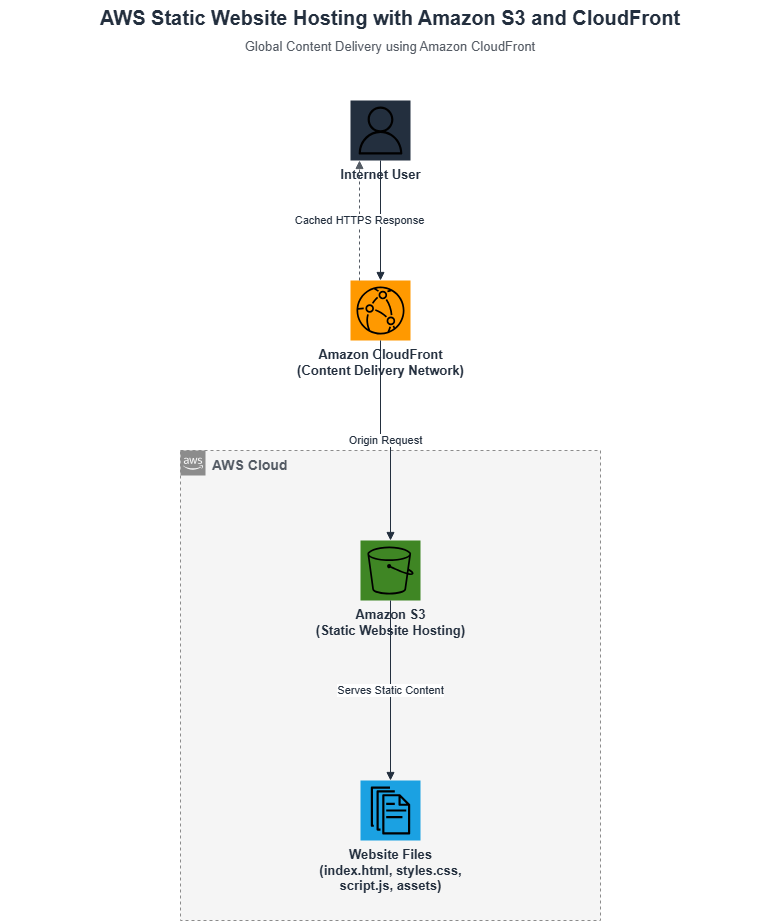
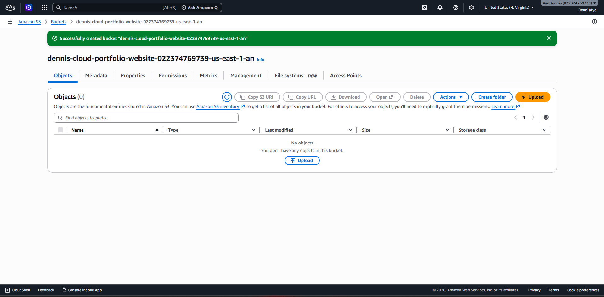
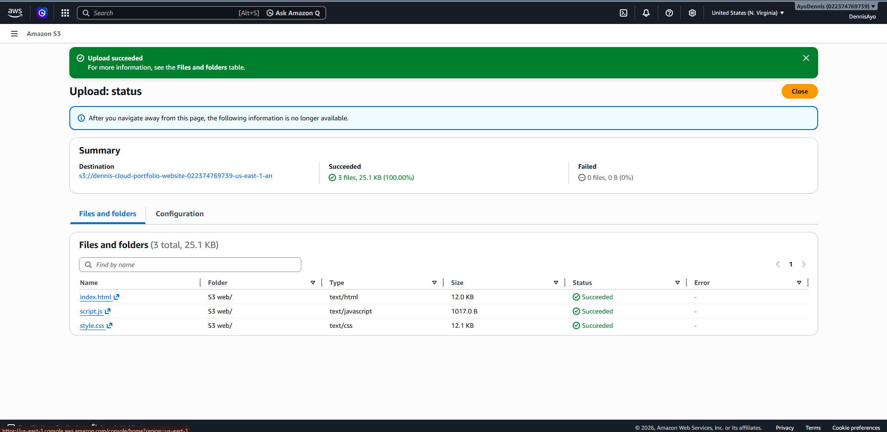
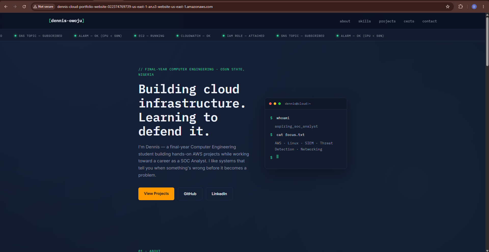
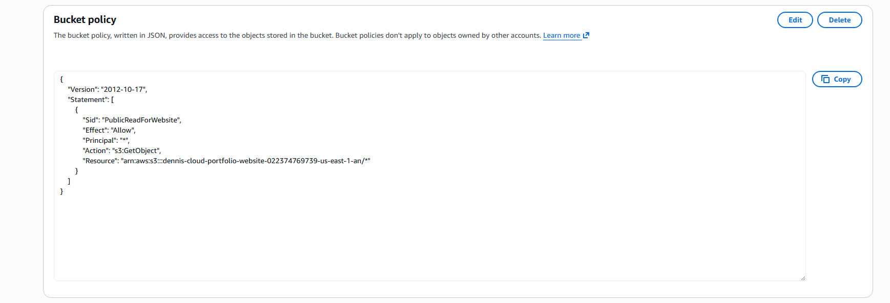
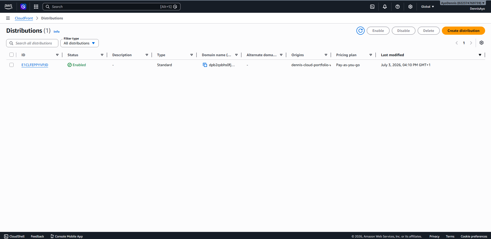
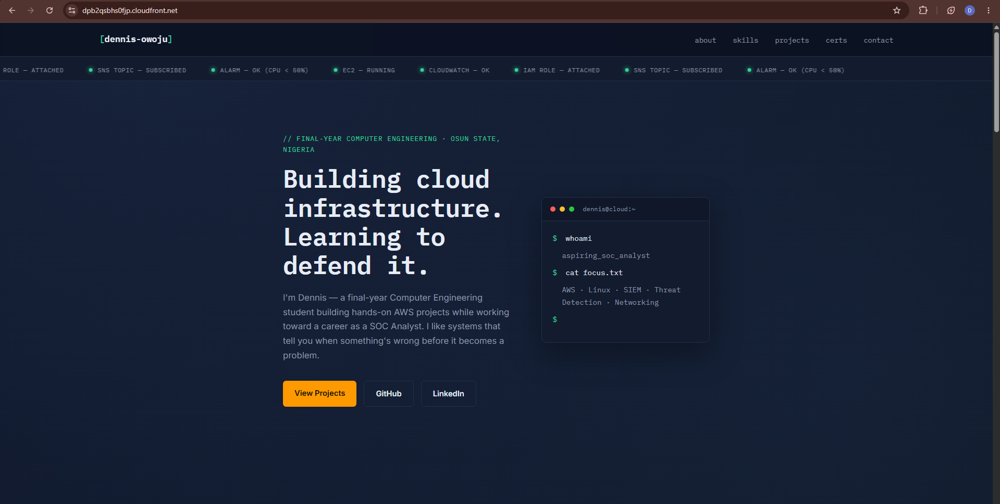
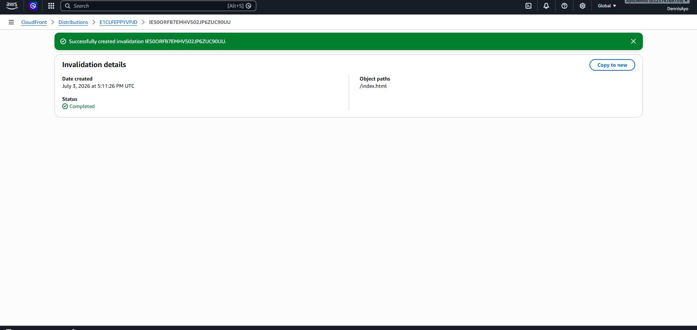

# 🌐 AWS S3 Static Website Hosting with CloudFront

A production-inspired static website deployment using **Amazon S3** and **Amazon CloudFront**. This project demonstrates how to host a static portfolio website, deliver it globally through a Content Delivery Network (CDN), and manage content updates using CloudFront cache invalidation.

---

## 📖 Project Overview

This project showcases how to deploy a static website using **Amazon S3** as the hosting platform and **Amazon CloudFront** as the global content delivery network.

Instead of serving content directly from Amazon S3, CloudFront is placed in front of the bucket to improve performance through caching, provide HTTPS access, and reduce latency by serving content from AWS edge locations closer to users.

---

## 🏗️ Architecture

<p align="center">
  
</p>

### Architecture Flow

```
                User
                  │
                  ▼
      Amazon CloudFront (CDN)
                  │
                  ▼
     Amazon S3 Static Website
                  │
                  ▼
HTML • CSS • JavaScript • Images
```

---

# 🚀 AWS Services Used

| AWS Service | Purpose |
|-------------|---------|
| Amazon S3 | Hosts the static website files |
| Amazon CloudFront | Delivers website content globally through edge locations |
| IAM | Provides secure access to AWS resources |

---

# 🎯 Project Objectives

- Deploy a static website using Amazon S3
- Configure static website hosting
- Configure bucket permissions for website access
- Deliver website content through CloudFront
- Understand CDN caching behavior
- Perform CloudFront cache invalidation
- Gain hands-on experience troubleshooting common deployment issues

---

# ⚙️ Deployment Steps

### 1. Create an Amazon S3 Bucket

- Created a globally unique S3 bucket
- Enabled server-side encryption (default)
- Left Object Ownership as **Bucket owner enforced**

---

### 2. Upload Website Files

Uploaded the following website files:

- `index.html`
- `styles.css`
- `script.js`

---

### 3. Enable Static Website Hosting

Configured:

- Static Website Hosting
- Index document:
  - `index.html`

---

### 4. Configure Bucket Permissions

- Disabled Block Public Access
- Applied a bucket policy granting **read-only access** to website objects

---

### 5. Create CloudFront Distribution

Configured:

- Origin: Amazon S3 Website Endpoint
- Default Root Object:
  - `index.html`
- Viewer Protocol Policy:
  - Redirect HTTP to HTTPS

---

### 6. Verify Website Deployment

Verified that the website loads successfully using the CloudFront distribution domain.

---

### 7. Perform Cache Invalidation

Updated the website content and created a CloudFront invalidation to refresh cached content across edge locations.

---

# 📸 Deployment Screenshots

## Amazon S3 Bucket



---

## Uploaded Website Files



---

## Static Website Hosting



---

## Bucket Policy



---

## CloudFront Distribution



---

## Live Website



---

## Cache Invalidation



---

# 🔒 Security Considerations

This project follows several AWS security best practices:

- Bucket permissions grant **read-only** access to website objects.
- HTTPS is provided through Amazon CloudFront.
- IAM was used for authenticated AWS management.
- Server-side encryption remains enabled for objects stored in Amazon S3.

### Production Improvement

For a production deployment, the S3 bucket should remain private by using:

- **CloudFront Origin Access Control (OAC)**

instead of exposing the bucket publicly.

---

# 💰 Cost Considerations

This project is suitable for learning using the AWS Free Tier.

Potential costs include:

- Amazon S3 storage
- PUT and GET requests
- CloudFront data transfer
- CloudFront requests

For a small personal portfolio website, operating costs remain minimal.

---

# 🛠️ Troubleshooting

During deployment, several real-world issues were encountered and resolved.

### Issue 1 — 404 NoSuchKey

**Problem**

CloudFront/S3 returned:

```
404 NoSuchKey
```

**Cause**

The entire website folder was uploaded instead of the contents.

**Resolution**

Uploaded:

```
index.html
styles.css
script.js
```

directly into the bucket root.

---

### Issue 2 — 504 Gateway Timeout

**Problem**

CloudFront returned:

```
504 Gateway Timeout
```

**Cause**

The full S3 website URL (including `http://` and `/`) was configured as the origin.

**Resolution**

Configured the origin using only the S3 website endpoint hostname.

---

### Issue 3 — Website Updates Not Appearing

**Problem**

CloudFront continued serving old website content.

**Cause**

CloudFront cached the previous version of the website.

**Resolution**

Created a CloudFront invalidation to refresh cached content.

---

# 📚 Lessons Learned

Through this project I gained practical experience with:

- Amazon S3 Static Website Hosting
- Bucket Policies
- CloudFront distributions
- CDN caching
- HTTPS delivery
- CloudFront cache invalidation
- Troubleshooting deployment issues
- Static website architecture on AWS

---

# 🚀 Future Improvements

Potential enhancements include:

- Configure a custom domain using Amazon Route 53
- Secure the website with AWS Certificate Manager (ACM)
- Use CloudFront Origin Access Control (OAC)
- Enable Amazon S3 Versioning
- Automate deployments using GitHub Actions
- Provision infrastructure using Terraform

---

# 📂 Repository Structure

```
aws-s3-cloudfront-static-website/
│
├── Architecture/
│   ├── aws-s3-cloudfront-architecture.drawio
│   └── aws-s3-cloudfront-architecture.png
│
├── Screenshots/
│   ├── 01-s3-bucket-overview.png
│   ├── 02-uploaded-files.png
│   ├── 03-static-website-hosting.png
│   ├── 04-bucket-policy.png
│   ├── 05-cloudfront-distribution.png
│   ├── 06-live-website.png
│   └── 07-cache-invalidation.png
│
├── Website/
│   ├── index.html
│   ├── styles.css
│   ├── script.js
│   └── assets/
│
├── README.md
├── LICENSE
└── .gitignore
```

---

# 🌍 Live Demo

**CloudFront URL:** https://dpb2qsbhs0fjp.cloudfront.net/

---

# 👨‍💻 Author

**Dennis Owoju**

- GitHub: https://github.com/owojudennis-lab
- LinkedIn: https://www.linkedin.com/in/owoju-dennis/

---

## ⭐ If you found this project interesting, feel free to star the repository.
